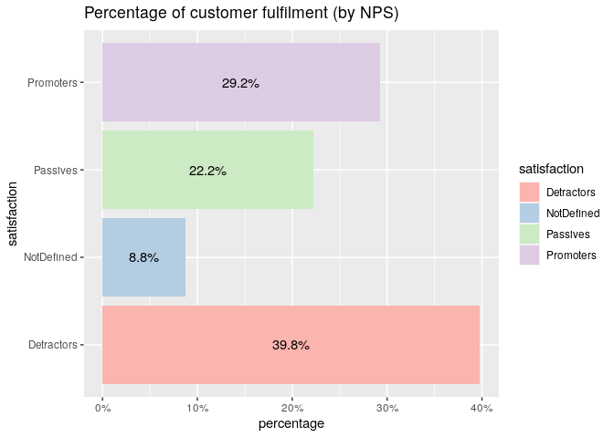

project2ba
================
Scherbakova Anna and Varvara Vasyukova (team Mentally Unstable)
08 12 2021

<https://docs.google.com/document/d/1rCxsDlO_WPbgE51wU-W2Pg4fKMJNdVWw-rtmxlyM5aY/edit?usp=sharing>
link to shared document

# Main results

The **aim** of this report is to describe the situation about customers
of Sber.Market and build predictive models that will help to assess the
situation in the future. The existing system of Sber.Market fails to
retain customers and to meet their needs.

The report **provides** several plots for understanding the current
situation, and in order to identify key metrics for customer churn and
satisfaction. Then the linear and logistic regression models are built
in order to predict customers’ churn and satisfaction.

The **results** suggest that right now women and people aged 25-34
prevail as audience of Sber.Market. App is more popular than website and
leads to higher satisfaction, however, older people prefer the site.
However, the service is losing their regular buyers, number of
dissatisfied customers and the churn rate are extremely high. Current
churn rate is 25%.

**Limitations** are so that the dataset lacks date data, which would
really help to identify LTV and compute Survival Analysis.

### Uploading all data files

### Merge all together

# Exploratory Data Analysis

### Demographics

``` r
genders <- sber %>% group_by(gender) %>% # too simple, useless
dplyr :: summarise(count = n()) %>%
mutate(percentage = count/sum(count))

ggplot(genders, aes(gender,percentage, fill = gender)) +
geom_bar(stat='identity') +
scale_y_continuous(labels = scales::percent) +
scale_fill_brewer(palette = "Pastel1", labels= c("Женщина"="Female","Мужчина"="Male")) +
scale_color_brewer(palette = "Pastel1",
labels= c("Женщина"="Female","Мужчина"="Male")) +
scale_x_discrete(labels= c("Женщина"="Female","Мужчина"="Male")) +
geom_text(aes(label=scales::percent(percentage)), position = position_stack(vjust = .5))
```

<!-- -->

This graph shows the percentage of women to men among the company’s
customers. So, Slightly more than half (59%) of women, while 41% of men
are among the customers of the Sber.Market.

``` r
ggplot(sber, # better, 2 in 1 
aes(x = age_group,
fill = gender)) +
geom_bar(position = "dodge") +
scale_fill_brewer(palette = "Pastel1", labels= c("Женщина"="Female","Мужчина"="Male")) +
scale_color_brewer(palette = "Pastel1",
labels= c("Женщина"="Female","Мужчина"="Male")) +
scale_x_discrete(labels= c("15-24","25-34", "35-44", "45-54", "55-64", "65-74", "75 and older" )) +
xlab("age group") + ylab("amount") +
ggtitle("Amount of clients by age group and gender")
```

<!-- -->

This graph shows that there are significantly more women than men among
the company’s clients. Also, the service is more often used by age
groups 15-24, 25-34 and 35-44 years old. However, the number of clients
among the age group 25-34 years old significantly predominates.

``` r
ggplot(sber,
aes(age_group,
fill = platform)) +
geom_bar(position = "dodge") +
scale_fill_brewer(palette = "Pastel1") +
scale_color_brewer(palette = "Pastel1") +
scale_x_discrete(labels= c("15-24","25-34", "35-44", "45-54", "55-64", "65-74", "75 and older" )) +
xlab("age group") + ylab("amount") +
ggtitle("Distribution of clients on different platforms by age")
```

<!-- -->

We also decided to consider how age groups are distributed by platforms.
In general, we can conclude that the appl is more popular among users.
Although starting with the age group 45-54 and older, the prevalence of
the application is falling. That is, older users prefer the web version
of the service.

### Active/non-active users

``` r
a <- ggplot(sber, aes(x = timediff_order))
a + geom_histogram(aes(color = gender, fill = gender),
                         alpha = 0.4, position = "identity") +
  scale_fill_brewer(palette = "Pastel1",
                    labels = c("Female", "Male")) +
  scale_color_brewer(palette = "Pastel1",
                     labels = c("Female", "Male")) +
  labs(title = "Difference in days since last interaction by gender",
       x = "Days since last interaction",
       y = "Number of customers") 
```

<!-- -->

Here is the plot that shows how many customers of each gender has been
inactive for a certain number of days. We can see that the tendencies
are pretty much the same for both genders. Most of the customers have
been inactive for 90 to 150 days. A bit less customers have been
inactive for less than 50 days. But we can see that almost a third of
all customers haven’t interacted with the service for more than 150
days.

### Satisfaction

``` r
sberplat <- sber %>%
  dplyr :: count(satisfaction, platform) %>%
  mutate(pct = n / sum(n),
         pct_label = scales::percent(pct))


ggplot(sberplat, aes(x= satisfaction, fill = platform, y = pct)) +
  geom_col() +
  geom_text(aes(label=scales::percent(pct)),size = 3, position = position_stack(vjust = 0.5)) +
  scale_y_continuous(labels = scales::percent_format())+
    scale_fill_brewer(palette = "Pastel1") + 
  labs(title = "What platform makes customers more satisfied?",
       x = "Satisfaction",
       y = "Share of customers")
```

<!-- -->

Most ‘promoters’ use the app, and a little bit more ‘detractors’ prefer
the website. Thus, platform is rather important for users’ satisfaction.

### Percentage of customer fulfilment (by NPS)

``` r
satis <- sber %>% group_by(satisfaction) %>%
dplyr:: summarize(count = n()) %>%
mutate(percentage = count/sum(count))

ggplot(satis, aes(satisfaction, percentage, fill = satisfaction)) +
geom_bar(stat='identity') + coord_flip() +
scale_y_continuous(labels = scales::percent) +
scale_fill_brewer(palette = "Pastel1") +
scale_color_brewer(palette = "Pastel1") +
geom_text(aes(label=scales::percent(percentage)), position = position_stack(vjust = .5)) +
ggtitle("Percentage of customer fulfilment (by NPS)")
```

<!-- -->

According of this plot of the percentage of customer satisfaction by
NPS, we can conclude that the company has a lot of detractors at the
moment. Detractors are customers who are dissatisfied who are less
likely to recommend your company to. In addition, these are customers
who are most likely to churn.

### RFM

``` r
sber$frequency <- sber$num_orders
summary(sber$frequency)
```

    ##    Min. 1st Qu.  Median    Mean 3rd Qu.    Max. 
    ##    2.00    5.00    9.00   11.57   15.00  174.00

``` r
sber$monetary <- sber$avg_check
summary(sber$monetary)
```

    ##    Min. 1st Qu.  Median    Mean 3rd Qu.    Max. 
    ##   15.39   98.24  121.95  138.68  155.60 2202.74

``` r
sber$recency <- Hmisc::cut2(sber$timediff_order, g = 5)
table(sber$recency)
```

    ## 
    ## [  2, 48) [ 48, 85) [ 85,116) [116,152) [152,242] 
    ##      1234      1194      1199      1242      1168

``` r
sber$frequency_d <- Hmisc::cut2(sber$frequency, g = 5)
table(sber$frequency_d)
```

    ## 
    ## [ 2,  5) [ 5,  8) [ 8, 12) [12, 18) [18,174] 
    ##     1379     1242     1227     1042     1147

``` r
sber$monetary <- Hmisc::cut2(sber$avg_check, g = 5)
table(sber$monetary)
```

    ## 
    ## [ 15.4,  93) [ 93.0, 112) [112.4, 133) [133.3, 166) [166.3,2203] 
    ##         1212         1203         1208         1209         1205

``` r
levels(sber$recency) <- c(5:1)
table(sber$recency)
```

    ## 
    ##    5    4    3    2    1 
    ## 1234 1194 1199 1242 1168

``` r
levels(sber$frequency_d) <- c(1:5)
table(sber$frequency_d)
```

    ## 
    ##    1    2    3    4    5 
    ## 1379 1242 1227 1042 1147

``` r
levels(sber$monetary) <- c(1:5)
table(sber$monetary)
```

    ## 
    ##    1    2    3    4    5 
    ## 1212 1203 1208 1209 1205

``` r
library(tidyverse)
sber <- sber %>% 
  mutate(rfm = paste0(recency,frequency_d,monetary)) 
head(sber)
```

    ##   user_id   CE_id mean_rate satisfaction avg_check timediff_order  gender
    ## 1    5619 CE_4720      0.00   NotDefined   122.935            210 Женщина
    ## 2    7216 CE_4110      0.00   NotDefined   173.410             97 Женщина
    ## 3    8699 CE_1790      3.33     Passives   120.385             42 Женщина
    ## 4   12439 CE_2500      2.14   Detractors   132.135            113 Женщина
    ## 5   18754 CE_1993      4.33    Promoters   304.590            105 Мужчина
    ## 6   21149 CE_2771      4.35    Promoters   192.520            227 Мужчина
    ##   age_group               city phone_id dw_kind platform      os   dw_id
    ## 1     45-54             Москва    58953 courier      web windows dw_4720
    ## 2     25-34             Москва    48456 courier      web android dw_4110
    ## 3     15-24             Москва   221634 courier      app     ios dw_1790
    ## 4     25-34 Московская Область   298302 courier      app     ios dw_2500
    ## 5     25-34             Москва   240359 courier      app     ios dw_1993
    ## 6     55-64 Московская Область    33024 courier      app     ios dw_2771
    ##   savings spendings num_orders frequency monetary recency frequency_d rfm
    ## 1 2202.30   9806.16          7         7        3       1           2 123
    ## 2  154.71   5941.84          7         7        5       3           2 325
    ## 3 1157.48  10710.42          3         3        3       5           1 513
    ## 4 2811.25   9195.59          7         7        3       3           2 323
    ## 5 4179.66  18044.99         15        15        5       3           4 345
    ## 6  720.90   6143.74         17        17        5       1           4 145

``` r
sber %>% 
  group_by(rfm) %>% 
  dplyr::summarise(n = n())
```

    ## # A tibble: 125 × 2
    ##    rfm       n
    ##    <chr> <int>
    ##  1 111       9
    ##  2 112       9
    ##  3 113       7
    ##  4 114       9
    ##  5 115      18
    ##  6 121      30
    ##  7 122      19
    ##  8 123      27
    ##  9 124      33
    ## 10 125      32
    ## # … with 115 more rows
    ## # ℹ Use `print(n = ...)` to see more rows

Firstly we counted RFM metrics themselves. Then we can plot the results:

``` r
sbersum <- sber %>%
  count(frequency_d, recency) %>%
  mutate(pct = n / sum(n),
         pct_label = scales::percent(pct))

ggplot(sbersum, aes(x= frequency_d, fill = recency, y = pct)) +
  geom_col() +
  geom_text(aes(label=scales::percent(pct)),size = 2.5, position = position_stack(vjust = 0.5)) +
  scale_y_continuous(labels = scales::percent_format())+
    scale_fill_brewer(palette = "Pastel1") + 
  labs(title = "How often and recently have customers ordered?",
       x = "Level of frequency",
       y = "Share of customers") 
```

<!-- -->

About 20% of customers that very rarely order things are quite recent,
which means that they probably tend to order many things at once, but
rarely. And almost 15% of customers that order frequently have not
ordered anything recently, so it means that the service is losing
regular buyers.

``` r
ggplot(sber, 
       aes(x = monetary, 
           fill = recency)) + 
  geom_bar(position = "stack")  
```

<!-- -->

Correlation between recency of customers and their monetary weight
showed no significant result.

``` r
sberos <- sber %>%
  count(os, platform) %>%
  mutate(pct = n / sum(n),
         pct_label = scales::percent(pct))


ggplot(sberos, aes(x= os, fill = platform, y = pct)) +
  geom_col() +
  geom_text(aes(label=scales::percent(pct)),size = 2, position = position_stack(vjust = 0.5)) +
  scale_y_continuous(labels = scales::percent_format())+
    scale_fill_brewer(palette = "Pastel1") + 
  labs(title = "Shares of customers using different platforms and OS's",
       x = "Platform",
       y = "Share of customers") 
```

<!-- -->

The result is logical, most smartphone users prefer the app over
website, and PC users prefer website, as probably the app for PC does
not exist or is inconvenient.

``` r
ggplot(sber, aes(x = frequency_d, y = timediff_order)) +
  geom_boxplot() +
  scale_fill_brewer(palette="Pastel1") +
  scale_color_brewer(palette = "Pastel1") +
    labs(title = "What customers are considered churned?",
       x = "Level of frequency",
       y = "Days since last interaction")
```

<!-- -->

We can say that regular buyers that haven’t interacted for many days can
be considered churned. On the plot we see that some share of customers
have the highest level of frequency, but they also have the most days,
more than 140 days, since last interaction. These customers most likely
have churned.

Create variable for churned customers:

``` r
sber$churned <- ifelse(sber$timediff_order > 150, "yes", "no")
sberlog <- select(sber, -user_id, -CE_id, -phone_id, -dw_id, -frequency, -monetary, -recency, -rfm)
head(sberlog)
```

    ##   mean_rate satisfaction avg_check timediff_order  gender age_group
    ## 1      0.00   NotDefined   122.935            210 Женщина     45-54
    ## 2      0.00   NotDefined   173.410             97 Женщина     25-34
    ## 3      3.33     Passives   120.385             42 Женщина     15-24
    ## 4      2.14   Detractors   132.135            113 Женщина     25-34
    ## 5      4.33    Promoters   304.590            105 Мужчина     25-34
    ## 6      4.35    Promoters   192.520            227 Мужчина     55-64
    ##                 city dw_kind platform      os savings spendings num_orders
    ## 1             Москва courier      web windows 2202.30   9806.16          7
    ## 2             Москва courier      web android  154.71   5941.84          7
    ## 3             Москва courier      app     ios 1157.48  10710.42          3
    ## 4 Московская Область courier      app     ios 2811.25   9195.59          7
    ## 5             Москва courier      app     ios 4179.66  18044.99         15
    ## 6 Московская Область courier      app     ios  720.90   6143.74         17
    ##   frequency_d churned
    ## 1           2     yes
    ## 2           2      no
    ## 3           1      no
    ## 4           2      no
    ## 5           4      no
    ## 6           4     yes

Making data standardized:

``` r
str(sberlog)
```

    ## 'data.frame':    6037 obs. of  15 variables:
    ##  $ mean_rate     : num  0 0 3.33 2.14 4.33 4.35 4.29 1 3.12 5 ...
    ##  $ satisfaction  : chr  "NotDefined" "NotDefined" "Passives" "Detractors" ...
    ##  $ avg_check     : num  123 173 120 132 305 ...
    ##  $ timediff_order: num  210 97 42 113 105 227 127 94 108 106 ...
    ##  $ gender        : chr  "Женщина" "Женщина" "Женщина" "Женщина" ...
    ##  $ age_group     : chr  "45-54" "25-34" "15-24" "25-34" ...
    ##  $ city          : chr  "Москва" "Москва" "Москва" "Московская Область" ...
    ##  $ dw_kind       : chr  "courier" "courier" "courier" "courier" ...
    ##  $ platform      : chr  "web" "web" "app" "app" ...
    ##  $ os            : chr  "windows" "android" "ios" "ios" ...
    ##  $ savings       : num  2202 155 1157 2811 4180 ...
    ##  $ spendings     : num  9806 5942 10710 9196 18045 ...
    ##  $ num_orders    : num  7 7 3 7 15 17 25 5 8 8 ...
    ##  $ frequency_d   : Factor w/ 5 levels "1","2","3","4",..: 2 2 1 2 4 4 5 2 3 3 ...
    ##  $ churned       : chr  "yes" "no" "no" "no" ...
    ##  - attr(*, "na.action")= 'omit' Named int [1:238] 49 65 92 104 126 142 184 209 215 259 ...
    ##   ..- attr(*, "names")= chr [1:238] "49" "65" "92" "104" ...

``` r
sberlog <- sberlog %>% 
  mutate_if(sapply(sberlog, is.character), as.factor)
str(sberlog)
```

    ## 'data.frame':    6037 obs. of  15 variables:
    ##  $ mean_rate     : num  0 0 3.33 2.14 4.33 4.35 4.29 1 3.12 5 ...
    ##  $ satisfaction  : Factor w/ 4 levels "Detractors","NotDefined",..: 2 2 3 1 4 4 4 1 3 4 ...
    ##  $ avg_check     : num  123 173 120 132 305 ...
    ##  $ timediff_order: num  210 97 42 113 105 227 127 94 108 106 ...
    ##  $ gender        : Factor w/ 2 levels "Женщина","Мужчина": 1 1 1 1 2 2 2 2 2 2 ...
    ##  $ age_group     : Factor w/ 7 levels "15-24","25-34",..: 4 2 1 2 2 5 2 2 2 4 ...
    ##  $ city          : Factor w/ 84 levels "Абакан","Альметьевск",..: 36 36 36 37 36 37 5 36 36 36 ...
    ##  $ dw_kind       : Factor w/ 3 levels "courier","express_delivery",..: 1 1 1 1 1 1 1 1 2 1 ...
    ##  $ platform      : Factor w/ 2 levels "app","web": 2 2 1 1 1 1 1 1 1 1 ...
    ##  $ os            : Factor w/ 6 levels "android","ios",..: 6 1 2 2 2 2 2 2 1 1 ...
    ##  $ savings       : num  2202 155 1157 2811 4180 ...
    ##  $ spendings     : num  9806 5942 10710 9196 18045 ...
    ##  $ num_orders    : num  7 7 3 7 15 17 25 5 8 8 ...
    ##  $ frequency_d   : Factor w/ 5 levels "1","2","3","4",..: 2 2 1 2 4 4 5 2 3 3 ...
    ##  $ churned       : Factor w/ 2 levels "no","yes": 2 1 1 1 1 2 1 1 1 1 ...
    ##  - attr(*, "na.action")= 'omit' Named int [1:238] 49 65 92 104 126 142 184 209 215 259 ...
    ##   ..- attr(*, "names")= chr [1:238] "49" "65" "92" "104" ...

``` r
sberlog <- sberlog %>% 
  mutate_if(sapply(sberlog, is.factor), as.numeric)
table(sberlog$churned)
```

    ## 
    ##    1    2 
    ## 4829 1208

``` r
sberlog$churned[sberlog$churned == 2] <- 0  
table(sberlog$churned)
```

    ## 
    ##    0    1 
    ## 1208 4829

Making data scaled:

``` r
range01 <- function(x){(x-min(x))/(max(x)-min(x))}
library(plyr)
sber_scaled <- colwise(range01)(sberlog)
sber_scaled <- na.omit(sber_scaled)
head(sber_scaled)
```

    ##   mean_rate satisfaction  avg_check timediff_order gender age_group      city
    ## 1     0.000    0.3333333 0.04916463      0.8666667      0 0.5000000 0.4216867
    ## 2     0.000    0.3333333 0.07224055      0.3958333      0 0.1666667 0.4216867
    ## 3     0.666    0.6666667 0.04799883      0.1666667      0 0.0000000 0.4216867
    ## 4     0.428    0.0000000 0.05337064      0.4625000      0 0.1666667 0.4337349
    ## 5     0.866    1.0000000 0.13221280      0.4291667      1 0.1666667 0.4216867
    ## 6     0.870    1.0000000 0.08097717      0.9375000      1 0.6666667 0.4337349
    ##   dw_kind platform  os      savings  spendings  num_orders frequency_d churned
    ## 1       0        1 1.0 0.0105630035 0.02386762 0.029069767        0.25       0
    ## 2       0        1 0.0 0.0007420434 0.01441197 0.029069767        0.25       1
    ## 3       0        0 0.2 0.0055516802 0.02608027 0.005813953        0.00       1
    ## 4       0        0 0.2 0.0134837412 0.02237361 0.029069767        0.25       1
    ## 5       0        0 0.2 0.0200471155 0.04402731 0.075581395        0.75       1
    ## 6       0        0 0.2 0.0034576893 0.01490600 0.087209302        0.75       0

``` r
nrow(sber_scaled)
```

    ## [1] 6037

``` r
describe(sber_scaled)
```

    ##                vars    n mean   sd median trimmed  mad min max range  skew
    ## mean_rate         1 6037 0.57 0.31   0.62    0.58 0.35   0   1     1 -0.35
    ## satisfaction      2 6037 0.47 0.42   0.67    0.46 0.49   0   1     1  0.05
    ## avg_check         3 6037 0.06 0.04   0.05    0.05 0.02   0   1     1  7.41
    ## timediff_order    4 6037 0.43 0.24   0.41    0.41 0.27   0   1     1  0.46
    ## gender            5 6037 0.41 0.49   0.00    0.39 0.00   0   1     1  0.37
    ## age_group         6 6037 0.23 0.18   0.17    0.21 0.00   0   1     1  1.45
    ## city              7 6037 0.48 0.24   0.43    0.48 0.32   0   1     1  0.20
    ## dw_kind           8 6037 0.01 0.10   0.00    0.00 0.00   0   1     1  9.03
    ## platform          9 6037 0.43 0.50   0.00    0.42 0.00   0   1     1  0.27
    ## os               10 6037 0.42 0.43   0.20    0.40 0.30   0   1     1  0.44
    ## savings          11 6037 0.02 0.02   0.01    0.01 0.01   0   1     1 14.24
    ## spendings        12 6037 0.04 0.04   0.03    0.04 0.02   0   1     1  5.07
    ## num_orders       13 6037 0.06 0.06   0.04    0.05 0.04   0   1     1  4.06
    ## frequency_d      14 6037 0.47 0.36   0.50    0.47 0.37   0   1     1  0.11
    ## churned          15 6037 0.80 0.40   1.00    0.87 0.00   0   1     1 -1.50
    ##                kurtosis   se
    ## mean_rate         -1.01 0.00
    ## satisfaction      -1.68 0.01
    ## avg_check        107.70 0.00
    ## timediff_order    -0.56 0.00
    ## gender            -1.87 0.01
    ## age_group          2.76 0.00
    ## city              -0.82 0.00
    ## dw_kind           83.13 0.00
    ## platform          -1.93 0.01
    ## os                -1.61 0.01
    ## savings          507.61 0.00
    ## spendings         59.71 0.00
    ## num_orders        36.44 0.00
    ## frequency_d       -1.30 0.00
    ## churned            0.25 0.01

# Linear regression model (satisfaction)

``` r
library(sjPlot)
model <- lm(satisfaction ~ platform + frequency_d, data = sber_scaled)
tab_model(model)
```

<table style="border-collapse:collapse; border:none;">
<tr>
<th style="border-top: double; text-align:center; font-style:normal; font-weight:bold; padding:0.2cm;  text-align:left; ">
 
</th>
<th colspan="3" style="border-top: double; text-align:center; font-style:normal; font-weight:bold; padding:0.2cm; ">
satisfaction
</th>
</tr>
<tr>
<td style=" text-align:center; border-bottom:1px solid; font-style:italic; font-weight:normal;  text-align:left; ">
Predictors
</td>
<td style=" text-align:center; border-bottom:1px solid; font-style:italic; font-weight:normal;  ">
Estimates
</td>
<td style=" text-align:center; border-bottom:1px solid; font-style:italic; font-weight:normal;  ">
CI
</td>
<td style=" text-align:center; border-bottom:1px solid; font-style:italic; font-weight:normal;  ">
p
</td>
</tr>
<tr>
<td style=" padding:0.2cm; text-align:left; vertical-align:top; text-align:left; ">
(Intercept)
</td>
<td style=" padding:0.2cm; text-align:left; vertical-align:top; text-align:center;  ">
0.49
</td>
<td style=" padding:0.2cm; text-align:left; vertical-align:top; text-align:center;  ">
0.47 – 0.51
</td>
<td style=" padding:0.2cm; text-align:left; vertical-align:top; text-align:center;  ">
<strong>\<0.001</strong>
</td>
</tr>
<tr>
<td style=" padding:0.2cm; text-align:left; vertical-align:top; text-align:left; ">
platform
</td>
<td style=" padding:0.2cm; text-align:left; vertical-align:top; text-align:center;  ">
-0.17
</td>
<td style=" padding:0.2cm; text-align:left; vertical-align:top; text-align:center;  ">
-0.19 – -0.15
</td>
<td style=" padding:0.2cm; text-align:left; vertical-align:top; text-align:center;  ">
<strong>\<0.001</strong>
</td>
</tr>
<tr>
<td style=" padding:0.2cm; text-align:left; vertical-align:top; text-align:left; ">
frequency d
</td>
<td style=" padding:0.2cm; text-align:left; vertical-align:top; text-align:center;  ">
0.11
</td>
<td style=" padding:0.2cm; text-align:left; vertical-align:top; text-align:center;  ">
0.08 – 0.14
</td>
<td style=" padding:0.2cm; text-align:left; vertical-align:top; text-align:center;  ">
<strong>\<0.001</strong>
</td>
</tr>
<tr>
<td style=" padding:0.2cm; text-align:left; vertical-align:top; text-align:left; padding-top:0.1cm; padding-bottom:0.1cm; border-top:1px solid;">
Observations
</td>
<td style=" padding:0.2cm; text-align:left; vertical-align:top; padding-top:0.1cm; padding-bottom:0.1cm; text-align:left; border-top:1px solid;" colspan="3">
6037
</td>
</tr>
<tr>
<td style=" padding:0.2cm; text-align:left; vertical-align:top; text-align:left; padding-top:0.1cm; padding-bottom:0.1cm;">
R<sup>2</sup> / R<sup>2</sup> adjusted
</td>
<td style=" padding:0.2cm; text-align:left; vertical-align:top; padding-top:0.1cm; padding-bottom:0.1cm; text-align:left;" colspan="3">
0.047 / 0.046
</td>
</tr>
</table>

We can see that the kind of platform used and how often the customer
interacts with the service influence their satisfaction. The results of
model are significant, however, the change in satisfaction when the
frequncy is raised by one is small, and the correlation between platform
and satisfaction is negative. The model explains about 5% of the data,
so we can conclude that platform and frequency of interactions slighly
influence customers’ satisfaction.

Customer satisfaction is an important metric for a company, as it
demonstrates how customers’ fulfillment, which affects brand loyalty and
the desire to recommend the company. If the company has many loyal
customers and a good brand reputation, the company has less cost to
attract and retain customers. Therefore, the company needs to improve
customer satisfaction in order to increase CLV, decrease churn rate and
acquisition costs.

# Linear regression model (churn)

``` r
model2 <- lm(churned ~ platform + frequency_d + mean_rate + dw_kind, data = sber_scaled)
tab_model(model2)
```

<table style="border-collapse:collapse; border:none;">
<tr>
<th style="border-top: double; text-align:center; font-style:normal; font-weight:bold; padding:0.2cm;  text-align:left; ">
 
</th>
<th colspan="3" style="border-top: double; text-align:center; font-style:normal; font-weight:bold; padding:0.2cm; ">
churned
</th>
</tr>
<tr>
<td style=" text-align:center; border-bottom:1px solid; font-style:italic; font-weight:normal;  text-align:left; ">
Predictors
</td>
<td style=" text-align:center; border-bottom:1px solid; font-style:italic; font-weight:normal;  ">
Estimates
</td>
<td style=" text-align:center; border-bottom:1px solid; font-style:italic; font-weight:normal;  ">
CI
</td>
<td style=" text-align:center; border-bottom:1px solid; font-style:italic; font-weight:normal;  ">
p
</td>
</tr>
<tr>
<td style=" padding:0.2cm; text-align:left; vertical-align:top; text-align:left; ">
(Intercept)
</td>
<td style=" padding:0.2cm; text-align:left; vertical-align:top; text-align:center;  ">
0.91
</td>
<td style=" padding:0.2cm; text-align:left; vertical-align:top; text-align:center;  ">
0.89 – 0.94
</td>
<td style=" padding:0.2cm; text-align:left; vertical-align:top; text-align:center;  ">
<strong>\<0.001</strong>
</td>
</tr>
<tr>
<td style=" padding:0.2cm; text-align:left; vertical-align:top; text-align:left; ">
platform
</td>
<td style=" padding:0.2cm; text-align:left; vertical-align:top; text-align:center;  ">
0.06
</td>
<td style=" padding:0.2cm; text-align:left; vertical-align:top; text-align:center;  ">
0.04 – 0.08
</td>
<td style=" padding:0.2cm; text-align:left; vertical-align:top; text-align:center;  ">
<strong>\<0.001</strong>
</td>
</tr>
<tr>
<td style=" padding:0.2cm; text-align:left; vertical-align:top; text-align:left; ">
frequency d
</td>
<td style=" padding:0.2cm; text-align:left; vertical-align:top; text-align:center;  ">
-0.38
</td>
<td style=" padding:0.2cm; text-align:left; vertical-align:top; text-align:center;  ">
-0.41 – -0.36
</td>
<td style=" padding:0.2cm; text-align:left; vertical-align:top; text-align:center;  ">
<strong>\<0.001</strong>
</td>
</tr>
<tr>
<td style=" padding:0.2cm; text-align:left; vertical-align:top; text-align:left; ">
mean rate
</td>
<td style=" padding:0.2cm; text-align:left; vertical-align:top; text-align:center;  ">
0.07
</td>
<td style=" padding:0.2cm; text-align:left; vertical-align:top; text-align:center;  ">
0.04 – 0.11
</td>
<td style=" padding:0.2cm; text-align:left; vertical-align:top; text-align:center;  ">
<strong>\<0.001</strong>
</td>
</tr>
<tr>
<td style=" padding:0.2cm; text-align:left; vertical-align:top; text-align:left; ">
dw kind
</td>
<td style=" padding:0.2cm; text-align:left; vertical-align:top; text-align:center;  ">
0.17
</td>
<td style=" padding:0.2cm; text-align:left; vertical-align:top; text-align:center;  ">
0.07 – 0.26
</td>
<td style=" padding:0.2cm; text-align:left; vertical-align:top; text-align:center;  ">
<strong>0.001</strong>
</td>
</tr>
<tr>
<td style=" padding:0.2cm; text-align:left; vertical-align:top; text-align:left; padding-top:0.1cm; padding-bottom:0.1cm; border-top:1px solid;">
Observations
</td>
<td style=" padding:0.2cm; text-align:left; vertical-align:top; padding-top:0.1cm; padding-bottom:0.1cm; text-align:left; border-top:1px solid;" colspan="3">
6037
</td>
</tr>
<tr>
<td style=" padding:0.2cm; text-align:left; vertical-align:top; text-align:left; padding-top:0.1cm; padding-bottom:0.1cm;">
R<sup>2</sup> / R<sup>2</sup> adjusted
</td>
<td style=" padding:0.2cm; text-align:left; vertical-align:top; padding-top:0.1cm; padding-bottom:0.1cm; text-align:left;" colspan="3">
0.118 / 0.117
</td>
</tr>
</table>

In this model the churn is predicted by the kind of platform, how often
customer interacts with the service, their mean rating of the service
and the kind of delivery they prefer. We can see that all these
predictors are significant, but their influence of the churn is quite
small. This model explains about 16% of data, which is reasonable. Later
we can compare this model to the same one but with logistic regression.

# Logistic regression model

``` r
set.seed(42)
sber_split <- initial_split(sber_scaled, prop = .8)
training <- training(sber_split)
testing <- testing(sber_split)
testing = testing[complete.cases(testing),]

model <- glm(churned ~ platform + frequency_d + mean_rate + dw_kind, data = training)
summary(model)
```

    ## 
    ## Call:
    ## glm(formula = churned ~ platform + frequency_d + mean_rate + 
    ##     dw_kind, data = training)
    ## 
    ## Deviance Residuals: 
    ##     Min       1Q   Median       3Q      Max  
    ## -1.0396   0.0045   0.1137   0.2452   0.4856  
    ## 
    ## Coefficients:
    ##             Estimate Std. Error t value Pr(>|t|)    
    ## (Intercept)  0.90262    0.01469  61.443  < 2e-16 ***
    ## platform     0.06270    0.01141   5.493 4.16e-08 ***
    ## frequency_d -0.38819    0.01542 -25.174  < 2e-16 ***
    ## mean_rate    0.09038    0.01844   4.901 9.84e-07 ***
    ## dw_kind      0.27230    0.05709   4.770 1.90e-06 ***
    ## ---
    ## Signif. codes:  0 '***' 0.001 '**' 0.01 '*' 0.05 '.' 0.1 ' ' 1
    ## 
    ## (Dispersion parameter for gaussian family taken to be 0.1412077)
    ## 
    ##     Null deviance: 773.96  on 4828  degrees of freedom
    ## Residual deviance: 681.19  on 4824  degrees of freedom
    ## AIC: 4258.2
    ## 
    ## Number of Fisher Scoring iterations: 2

``` r
library(jtools)
summ(model, exp = T)
```

    ## MODEL INFO:
    ## Observations: 4829
    ## Dependent Variable: churned
    ## Type: Linear regression 
    ## 
    ## MODEL FIT:
    ## χ²(4) = 92.77, p = 0.00
    ## Pseudo-R² (Cragg-Uhler) = 0.19
    ## Pseudo-R² (McFadden) = 0.13
    ## AIC = 4258.22, BIC = 4297.12 
    ## 
    ## Standard errors: MLE
    ## ------------------------------------------------------------
    ##                     exp(Est.)   2.5%   97.5%   t val.      p
    ## ----------------- ----------- ------ ------- -------- ------
    ## (Intercept)              2.47   2.40    2.54    61.44   0.00
    ## platform                 1.06   1.04    1.09     5.49   0.00
    ## frequency_d              0.68   0.66    0.70   -25.17   0.00
    ## mean_rate                1.09   1.06    1.13     4.90   0.00
    ## dw_kind                  1.31   1.17    1.47     4.77   0.00
    ## ------------------------------------------------------------
    ## 
    ## Estimated dispersion parameter = 0.14

P-values show that all predictors are significant. The pseudo-R-squared
show that model fit is reasonable.

``` r
testing$predictions <- predict(model, newdata = testing, type = "response")
testing$p.class <- if_else(testing$predictions > 0.5,1,0)
p.class = factor(testing$p.class,levels = c(1,0))
actual.factor = factor(testing$churned, levels = c(1,0))
library(e1071)
confusionMatrix(p.class, actual.factor)
```

    ## Confusion Matrix and Statistics
    ## 
    ##           Reference
    ## Prediction   1   0
    ##          1 968 240
    ##          0   0   0
    ##                                           
    ##                Accuracy : 0.8013          
    ##                  95% CI : (0.7777, 0.8235)
    ##     No Information Rate : 0.8013          
    ##     P-Value [Acc > NIR] : 0.5173          
    ##                                           
    ##                   Kappa : 0               
    ##                                           
    ##  Mcnemar's Test P-Value : <2e-16          
    ##                                           
    ##             Sensitivity : 1.0000          
    ##             Specificity : 0.0000          
    ##          Pos Pred Value : 0.8013          
    ##          Neg Pred Value :    NaN          
    ##              Prevalence : 0.8013          
    ##          Detection Rate : 0.8013          
    ##    Detection Prevalence : 1.0000          
    ##       Balanced Accuracy : 0.5000          
    ##                                           
    ##        'Positive' Class : 1               
    ## 

``` r
F1_Score(actual.factor, p.class)
```

    ## [1] 0.8897059

We built a model that predicts customers’ churn based on the platform
they’re using, how often they use the service, the rating they gave the
service and the kind of delivery they prefer. The accuracy of the model
is 76%, so overall the model correctly identified 76% of cases.
Precision is 78% which means that out of all customers that are
predicted not to churn, 78% correctly haven’t churned according to data.
And recall is 93% and it means that we are missing only about 7% of
customers that retained. The harmonic mean of precision and recall is
85%, and it also tells us that the model is quite good. However, there
are 57 false negative results, so model incorrectly identified 57
customers to stay, but actually they churn. And otherwise, the model
incorrectly classified 229 people to stay, when in reality they are
retained. We can conclude that this model is better than the linear one
as the R-squared of this model is slightly higher than the linear
regression one’s.

Using this model, the company can predict whether a customer is likely
to churn or not with about 76% correct result. Predicting churn can help
to understand how satisfied are the customers with the service, to see
the reasons why the customers are leaving and to prevent churning of
future customers. This, in turn, will help to identify what products,
services or even departments in the company need improvement.

Also the company would save at least 215 000 rubles, that currently have
been lost due to the churned customers.
